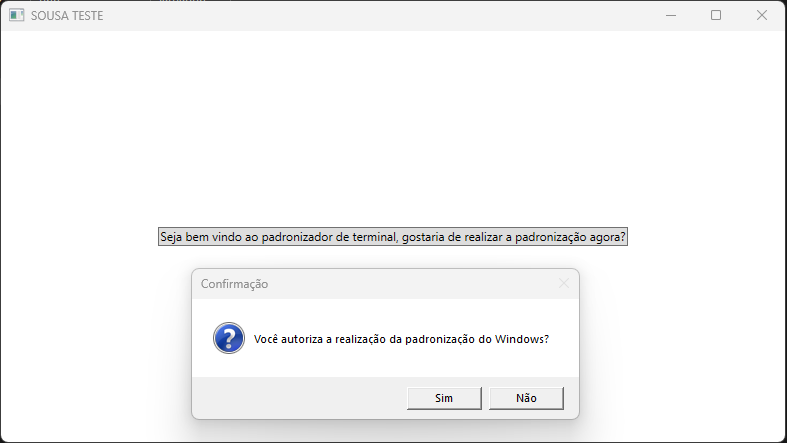

# ConsoleInterativo_v1
 
Project Console Interativo Versão 1.0  
 
Projeto incial em teste, apenas criado para solucionar um problema, no caso a padronizar o windows de forma interativa, para que usuários consigam realizar a partir desse executável.  
 
<figure>

</figure>
 
Essa primeiro versão foi feita somente para estruturação do código, logo será disponibilizada a segunda versão!
 
